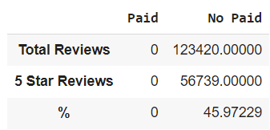

# Challenge_16

## Overview of the Analysis

Amazon Vine invites the most trusted reviewers on Amazon to post opinions about new and pre-release items to help their fellow customers make informed purchase decisions. Amazon invites customers to become Vine Voices based on their reviewer rank, which is a reflection of the quality and helpfulness of their reviews as judged by other Amazon customers. 

Companies like SellBy pay a small fee to Amazon and provide products to Amazon Vine members, who are then required to publish a review, then, the purpose of this analysis is to determine if there is any bias toward favorable reviews from Vine members in the Mobile Apps market using the related Amazon Vine databasis.

## Results

After some analysis, we noted: 

1) As expected, there are not apps included at the program of paid reviews but there are 123,420 no paid reviews.  
2) 56,739 apps were reviewed with 5 stars. 
3) 45.97% of the no paid reviews were 5 stars.

## Summary

We can't conclude bias in this particular basis since there is not part of the Amazon Vine Program, nevertheless, we can conclude that almost 50% of total reviews assigned 5 starts to apps implying a bias in rated apps. 

To have a better understanding among the correlation, we may need to review the rest of ratings for no paid reviews. 
